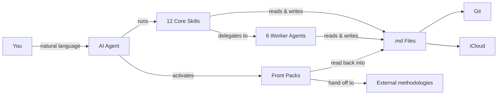
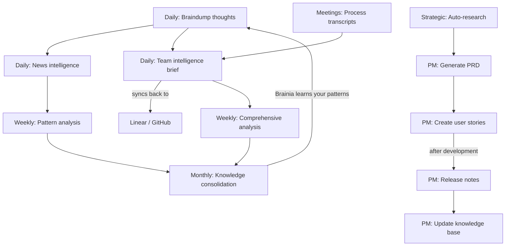

# Brainia — A Second Brain for Your Whole Life, Not Your Job Title

**Built on the COG engine (Cognition + Obsidian + Git)** — a self-evolving second brain powered by AI agents, markdown files, and version control. No database, no vendor lock-in — just `.md` files that think.

Two rules make it different from other agentic second brains:

1. **It never asks what you do for a living.** No job-title taxonomy, no role questionnaire, and no smaller product for people whose work is not software. A nurse, a teacher and a staff engineer get the same full core.
2. **The core carries no domain tooling.** Capture, synthesis and knowledge are core. Anything domain-specific belongs to a **front**, meaning one area of your life, and a front that needs real machinery points at an external tool rather than bundling one. The software front is the worked example: it hands off to [devaing](#fronts--where-domain-work-lives) and Brainia itself contains no development tooling at all.

[Quick Start](#quick-start) | [Skills](#skills) | [Features](#features-at-a-glance) | [FAQ](#faq) | [SETUP.md](SETUP.md)

> Works with [Claude Code](https://claude.ai/download) &bull; [Cursor](https://cursor.com/) &bull; [Kiro](https://kiro.dev/) &bull; [Gemini CLI](https://github.com/google-gemini/gemini-cli) &bull; [OpenAI Codex](https://github.com/openai/codex) &bull; any AI that reads markdown
>
> Inspired by [Garry Tan's gstack](https://github.com/garrytan/gstack) and [gbrain](https://github.com/garrytan/gbrain)



> **New to Brainia?** Watch the [2-minute walkthrough](https://youtube.com/PLACEHOLDER) to see it in action.

## Where this fits — your AI-coached life

This second brain is the **`Brain/`** of a larger container: your whole life, coached by AI. `Brain/` is the cognition engine that thinks across everything. Every life front is a **physical sibling folder** of `Brain/` — they vary per person.

```
AI-Coached-Life/        # your whole life, AI-coached   (required)
├── Brain/              # the second brain — this repo   (required)
├── Code/               # software front — building and shipping
├── Strategy/           # strategy front — ventures, intel, GTM
├── Health/             # health front
└── ...                 # whatever fronts your life has
```

`Brain/` is the only required folder besides the container root. Sources, documentation, and artifacts live in each sibling folder; `.md` knowledge lives only in `Brain/vault/` and points back to them. The `Code/` front is execution only, so a venture's strategy, ownership, co-founders, and finances live in other fronts. The brand of the brain (it runs on the **COG** engine today, **gbrain** later) lives inside `Brain/`; the container itself is engine-agnostic.

**Name it whatever you want.** `Brain/` above is just the clearest name for the role. Yours can be `my-brain/`, `segundo-cerebro/`, your own name, anything. Brainia finds the brain by its contents, never by its folder name, so nothing breaks if you rename it later.

**Your fronts are yours, and they move.** Which fronts exist varies per person and changes over the life of the brain: fronts get added, renamed, merged and dropped. The filesystem is the source of truth, not any registry inside `Brain/`. A new sibling folder is the model working as intended, never something to ratify. `fronts/` holds optional declarations for the fronts that need one, and Brain itself is never a front, it is the engine that thinks across all of them.

## Quick Start

**1. Clone it as the `Brain/` of your life container:**
```bash
mkdir AI-Coached-Life
git clone https://github.com/builes-carlos/brainia.git AI-Coached-Life/Brain
cd AI-Coached-Life/Brain
```

**2. Run onboarding in your agent:**

| Agent | Command | How it finds skills |
|---|---|---|
| Claude Code | `code .` → "Run onboarding" | `.claude/skills/` |
| Cursor | Open folder → "Run onboarding" | `.cursor-plugin/` + `.cursorrules` |
| Kiro | Open folder → "setup Brainia" | `.kiro/powers/` |
| Gemini CLI | `gemini` → `/onboarding` | `GEMINI.md` + `.gemini/commands/` |
| OpenAI Codex | `codex` → "Run onboarding" | `AGENTS.md` |
| Other agents | Point at `AGENTS.md` → "Run onboarding" | `AGENTS.md` |

Done — Brainia is personalized and ready in ~2 minutes. See [SETUP.md](SETUP.md) for optional config (Git sync, iCloud, Obsidian Tasks, etc.).

## Agent Support Matrix

Brainia ships a **full Claude Code surface** plus **core native surfaces** for Kiro and Gemini CLI, with `AGENTS.md` as the universal fallback for Codex and other markdown-reading agents.

| Surface | Current support | Notes |
|---|---|---|
| Claude Code | 12 core skills + 6 worker agents + front packs | Full first-class surface |
| Cursor | Plugin manifest + rules | `.cursor-plugin/plugin.json` + `.cursorrules` |
| Kiro | 7 native powers | Core workflows today |
| Gemini CLI | 7 native commands | Core workflows today |
| `AGENTS.md` | 12 documented core commands | Universal fallback for Codex and other agents |

Before publishing or updating framework files, run `./scripts/validate-agent-surface.sh` to catch drift between manifests, docs, and shipped files. See [docs/AGENT-SUPPORT.md](docs/AGENT-SUPPORT.md) for the detailed support matrix and contributor rules.

## Skills

### Core Skills — everyone, every front

These twelve ship in the core and behave the same whatever your fronts are. Nothing here presumes a job, an industry, or a toolchain.

| Skill | What it does | Try saying... |
|---|---|---|
| **onboarding** | Detect your fronts and set up your vault (run first!) | "Run onboarding" |
| **braindump** | Capture raw thoughts with intelligent classification | "I need to braindump" |
| **daily-brief** | Verified news intelligence (7-day freshness) | "Give me my daily brief" |
| **url-dump** | Save URLs with auto-extracted insights | "Save this URL" |
| **scout** | Triage a URL or tool before deciding to save it | "Is this worth saving?" |
| **weekly-checkin** | Cross-front pattern analysis | "Weekly review" |
| **comprehensive-analysis** | Deep 7-day analysis for reviews and planning (~8-12 min) | "Weekly analysis" |
| **meeting-transcript** | Turn a recording into decisions, action items, and dynamics | "Process this meeting" |
| **knowledge-consolidation** | Build frameworks from scattered notes | "Consolidate my knowledge" |
| **auto-research** | Decompose a question into parallel research threads | "Research the future of X" |
| **front-sync** | Pull each front's own artifacts back into the vault, correcting what stopped being true | "Sync my fronts" |
| **update-cog** | Update framework files without touching your content | "Update COG" |

### Fronts — where domain work lives

A **front** is one area of your life, and it is a physical sibling folder of `Brain/`. Fronts are detected from the filesystem, never from a questionnaire. A front pack (`fronts/<id>.md`) is **optional**: it exists only when a front needs to declare something, and a front with no pack at all is completely normal.

A pack can do two things the core deliberately will not do for you:

- **Own skills.** Staged under `fronts/<id>/skills/` and copied into `.claude/skills/` only when you activate that front. A front you do not have never installs anything.
- **Delegate to an external methodology.** The pack names the tool, how to detect it, and which of its artifacts Brainia reads back into the vault.

Two packs ship with real content:

| Front | What it does |
|---|---|
| **`fronts/code.md`** | Delegates to **[devaing](https://github.com/builes-carlos/devaing)**, an external framework for building products with AI. Brainia does not plan, build, review, or ship code. It hands off to `/devaing-director` and stops. It reads each project's `CONTEXT.md` and `CHECKPOINTS.md` back into `vault/04-projects/`, which is how execution feeds the brain without the brain owning execution. |
| **`fronts/work.md`** | Owns the PM and delivery skills that used to sit in the core: `create-user-story`, `generate-prd`, `generate-release-notes`, `export-open-issues`, `update-knowledge-base`, `publish-to-confluence`, `team-brief`. They install only if you activate the Work front. |

Every other front (`health`, `finances`, `people`, `learning`, `career`, `strategy`, `biz`, `personal`) ships as a thin declaration with no tooling, which is the intended default rather than an omission. Write your own from `fronts/_template.md`.

### Worker Agents (Specialist Sessions)

Brainia uses a worker agent architecture inspired by [garrytan/gstack](https://github.com/garrytan/gstack) specialist sessions and [garrytan/gbrain](https://github.com/garrytan/gbrain) knowledge patterns. Workers handle data-heavy tasks cheaply (Sonnet) while the lead session does reasoning (Opus).

| Agent | What it does | Model |
|---|---|---|
| **worker-data-collector** | Structured extraction from GitHub, Slack, Jira, Linear | Sonnet |
| **worker-researcher** | Web research with source citations | Sonnet |
| **worker-file-ops** | Vault file operations, metadata, profiles | Sonnet |
| **worker-executor** | Pre-approved mutations (Jira, Linear, APIs) | Sonnet |
| **worker-publisher** | Publishing to Slack, Confluence, Notion | Sonnet |
| **brief-people-updater** | Batch-update people profiles from meetings/briefs | Sonnet |

> Workers write results to `/tmp/` files and return only a status + path. The lead reads the file for synthesis. This eliminates slow token generation in agent output.

### People CRM (Knowledge-Based Team Profiles)

Track the people you work with using progressive, evidence-based profiles in `vault/05-knowledge/people/`. Profiles auto-escalate via tiered enrichment:

- **Tier 3 (Stub)** — 1 mention: name, role, one-line context
- **Tier 2 (Moderate)** — 3+ mentions: executive snapshot, working style, strengths
- **Tier 1 (Full)** — 8+ mentions or direct meeting: complete profile with all sections

Every observation includes a source citation with confidence level. See `vault/05-knowledge/people/README.md` for details.

### Front-Local Profiles (Optional Recommendation Ordering)

A front may carry sub-profiles under `fronts/<id>/profiles/` that order recommendations *inside* that front. The software front ships `engineer` and `engineering-lead`; the Work front ships `product-manager`, `designer`, `marketer` and `founder`. Add your own from `fronts/_profile-template.md`.

These are reachable only when their front is active, they are never a gate, and they are never a prerequisite. If you never activate those fronts, Brainia never mentions a job title.

> **Front-owned skills and integrations degrade gracefully.** The Work front's skills work best with GitHub CLI (`gh`) plus Linear, Slack and PostHog MCP integrations, but start with one and add the rest over time. See [SETUP.md](SETUP.md) for configuration.

## The Evolution Cycle



- **Daily capture** — braindump raw thoughts; Brainia classifies by domain and extracts action items
- **Daily intelligence** — personalized news briefings with verified, sourced news
- **Daily team brief** — cross-reference GitHub, Linear, Slack, PostHog, meetings into one brief with two-way sync
- **Meeting processing** — extract decisions, action items, and team dynamics from transcripts
- **Weekly reflection** — pattern analysis across all domains surfaces insights you'd miss
- **Weekly deep dive** — comprehensive analysis for board prep, retros, and strategic planning
- **Monthly synthesis** — scattered notes become consolidated frameworks and a knowledge base
- **Strategic research** — deep multi-agent investigation of strategic questions with real sources
- **PM workflow** — full product lifecycle from PRD to release notes to knowledge base updates

## Features at a Glance

| | | |
|---|---|---|
| **Self-Evolving** — Learns your patterns, auto-organizes content, builds frameworks | **Self-Healing** — Rename files or restructure; cross-references update automatically | **Verification-First** — Sources required, 7-day freshness, confidence levels on all analysis |
| **Privacy-First** — Local `.md` files, strict domain separation, no external servers | **Multi-Device** — iCloud sync to iPhone/iPad/Mac; Git for version history | **Obsidian Tasks** — `📅 YYYY-MM-DD` emoji format works with Tasks plugin dashboards |
| **Garry Tan Inspired** — gstack specialist sessions + gbrain knowledge patterns | **Multi-Agent** — Claude Code, Cursor, Kiro, Gemini CLI, Codex, or any agent that reads markdown | **Worker Agents** — Sonnet handles I/O, Opus handles thinking |

## Your Vault

The cloned repo is your `Brain/` — inside it:

```
AI-Coached-Life/Brain/       # the second brain (this repo)
├── .claude/skills/          # core skills, domain-agnostic only (12)
├── .claude/agents/          # Worker agent definitions (6)
├── fronts/                  # Front packs (optional per front)
│   ├── _template.md         # write your own front
│   ├── code.md              # delegates to devaing
│   └── work/                # front-owned skills + profiles
├── .kiro/powers/            # Kiro powers
├── .gemini/commands/        # Gemini CLI commands
├── AGENTS.md                # Universal agent docs
├── CLAUDE.md                # Framework instructions
├── vault/00-inbox/                # Profiles, interests, integrations
├── vault/01-daily/                # Briefs & check-ins
├── vault/02-personal/             # Personal braindumps (private)
├── vault/03-professional/         # Professional braindumps & strategy
├── vault/04-projects/             # Per-project tracking
├── vault/05-knowledge/            # Consolidated insights & patterns
│   └── people/              # People CRM profiles
└── 06-templates/            # Document templates
```

> **Real-world results:** 120+ braindumps processed, daily briefs with 95%+ source accuracy, 5 major strategic insights discovered — zero maintenance required.

## Keeping COG Updated

COG separates **framework files** (skills, docs, scripts) from **your content** (braindumps, profiles, notes). Updates never touch your personal data.

| Method | Command |
|---|---|
| AI Agent (any) | "Update COG" or `/update-cog` |
| Shell script | `./cog-update.sh` (interactive) &bull; `--check` &bull; `--dry-run` &bull; `--force` |
| Manual Git | `git fetch cog-upstream main` then checkout specific files |

Check your version: `cat COG-VERSION`  
Validate packaged surfaces: `./scripts/validate-agent-surface.sh`

## FAQ

<details><summary><strong>Why not just use Notion / Roam / Obsidian alone?</strong></summary>

Brainia adds self-evolving intelligence on top. It doesn't just store — it learns, analyzes, and synthesizes insights automatically.
</details>

<details><summary><strong>How much does it cost?</strong></summary>

Brainia is free and open-source (MIT). You only pay for your AI agent's API usage.
</details>

<details><summary><strong>Is my data private?</strong></summary>

Yes. Everything is local markdown files. The AI agent's API is only called when you invoke a skill. No data stored on external servers.
</details>

<details><summary><strong>Can I customize or add skills?</strong></summary>

Yes — edit any `SKILL.md` / `POWER.md` / `AGENTS.md` file. See [SETUP.md](SETUP.md) for details on creating new skills.
</details>

<details><summary><strong>Will updating overwrite my customizations?</strong></summary>

No. The update process detects customized files and lets you choose per-file: keep yours, use upstream, or backup + update. Nothing is overwritten without approval.
</details>

<details><summary><strong>What if I don't use Git?</strong></summary>

Git is optional but recommended for version history. Brainia works fine with just iCloud sync.
</details>

## Roadmap

- [x] ~~Gemini CLI + OpenAI Codex support~~ (shipped in v3.1)
- [x] ~~Upstream update system~~ (shipped in v3.2)
- [x] ~~Role packs & integration discovery~~ (shipped in COG v3.3, **superseded by front packs** in Brainia)
- [x] ~~Fronts architecture: agnostic core, optional front packs, delegation to external methodologies~~
- [x] ~~PM workflow skills & auto-research~~ (shipped in v3.4)
- [x] ~~Worker agents, people CRM & specialist sessions~~ (shipped in v3.5)
- [ ] Web interface for knowledge graph visualization
- [ ] Mobile-first commands (optimized for Obsidian mobile)
- [ ] Team collaboration features (with privacy preservation)
- [ ] Integration with calendar/task management tools

## Contributing & Support

| | | |
|---|---|---|
| [Contribute](CONTRIBUTING.md) | [Report a Brainia bug](https://github.com/builes-carlos/brainia/issues) | [MIT License](LICENSE) |

Bugs in Brainia belong in this repo's issues. For the COG engine underneath, use [upstream issues](https://github.com/huytieu/COG-second-brain/issues) and [upstream discussions](https://github.com/huytieu/COG-second-brain/discussions) — and if you want to support the engine's author, [sponsor huytieu](https://github.com/sponsors/huytieu) or [buy them a coffee](https://buymeacoffee.com/0xlight).

## Acknowledgments & Inspiration

Built with [Claude Code](https://claude.ai/code), [Cursor](https://cursor.com/), [Kiro](https://kiro.dev/), [Gemini CLI](https://github.com/google-gemini/gemini-cli), [OpenAI Codex](https://github.com/openai/codex), and [Obsidian](https://obsidian.md/).

**Key inspirations:**
- [**Garry Tan's gstack**](https://github.com/garrytan/gstack) — specialist sessions, clear operating gears, repo-local skill distribution. Brainia's worker agent architecture and model routing borrow directly from gstack's explicit mode separation.
- [**Garry Tan's gbrain**](https://github.com/garrytan/gbrain) — Compiled Truth + Timeline pattern, tiered enrichment for people profiles, brain-first lookup protocol. Brainia's people CRM and knowledge-first approach are adapted from gbrain's design.
- **Zettelkasten** — atomic, interlinked notes as the foundation of knowledge
- **Building a Second Brain (Tiago Forte)** — PARA organization, progressive summarization
- **GTD (David Allen)** — capture everything, process systematically

## Star History

[](https://www.star-history.com/#builes-carlos/brainia&type=date&legend=top-left)

---

**TL;DR:** Clone, run onboarding, braindump daily. Brainia evolves with you — just `.md` files, any AI agent, zero maintenance.
